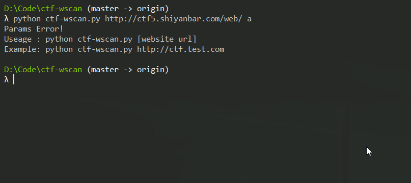

# ctf-wscan
一个为ctf而生的web扫描器

基于多线程的扫描器，可添加关键字，扫描一些备份文件和路径

# 使用方式

```
Useage : python ctf-wscan.py [website url]
Example: python ctf-wscan.py http://ctf.test.com
```



# 新增-k参数
```
Useage : python ctf-wscan.py [website url] [key words ……]
```
由于觉得添加关键字这个功能还是蛮常用的，于是添加了个`-k`参数，可以在命令行中添加参数


# 一些设置

可修改config.py下的一些设置，进行自定义扫描

```

# 关键字  
# 用于生成一些特定字符，进行进一步扫描，如可以输入一些 xxctf的关键词
KEY_WORDS = ['flag','ctf','kzhan.php']

# 线程数 
NUMBER_OF_THREAD = 10

# 请求方式
# 1 => HEAD  2 => GET
REQUEST_METHOD = 1

# 无效的状态码
# 自定义一些无效的状态码，作为判断的标准
INVALID_CODE = [404, 403]

# 超时时间
TIME_OUT = 3

# 记录缓存日志
CACHE_LOG = True
```

